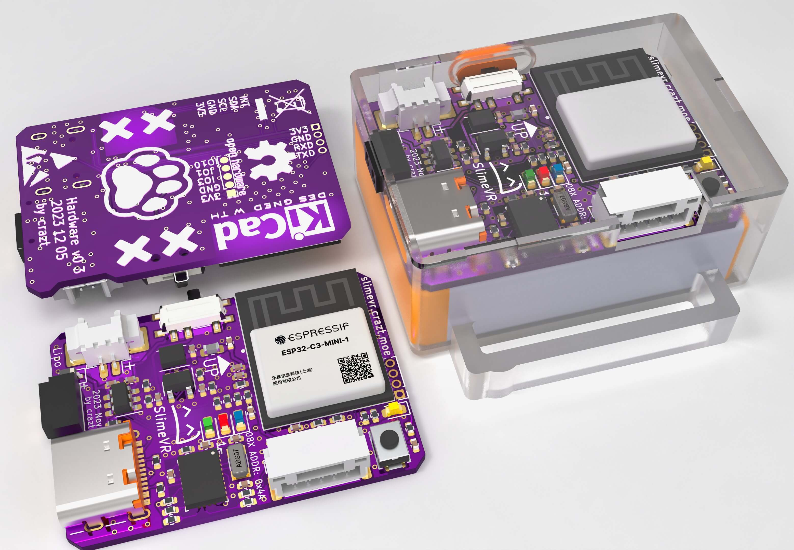
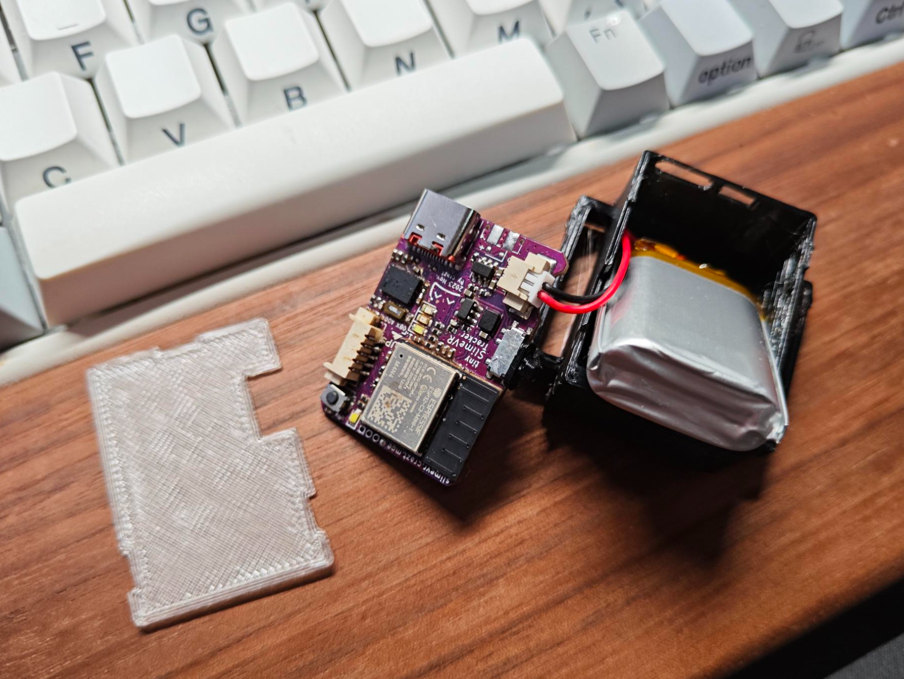
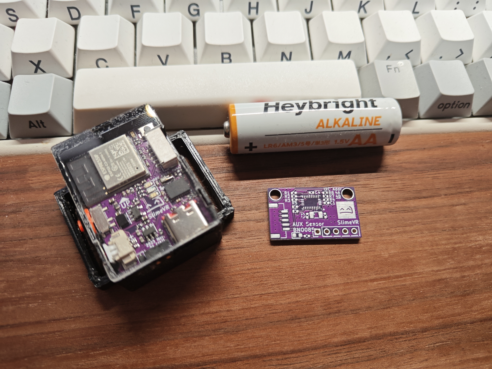

# SlimeVR-Tracker  CC Version

Crazt 的小体积 SlimeVR 硬件方案



## Components

主要器件选型：

| Main Component | Specification                    | Note                                                         |
| -------------- | -------------------------------- | ------------------------------------------------------------ |
| SoC Module     | ESP32-C3-MINI-1                  |                                                              |
| IMU            | BNO085                           | IMU Comparison [BNO085](https://docs.slimevr.dev/diy/imu-comparison.html#bno085) |
| Charging       | LGS4084HB6                       | 400 mA charging current                                      |
| Power Supply   | SY8088IAAC                       | step down DC/DC regulator，1A output current                 |
| Battery        | 1000mAh polymer lithium battery, | `35*25*10mm` (WxLxH) or 102535, Molex 1.25 2pin connector, 35mm lead length |

PCB 接口：

| Interfaces                   | Specification                          | Note                            |
| ---------------------------- | -------------------------------------- | ------------------------------- |
| USB                          | USB4105 - **Type C** USB 2.0 Connector | charging and firmware burning   |
| Sub-tracking interface (AUX) | JST_GH_SM05B                           | self-locking connector          |
| Pogo pin connector           | 2 pin  2.5mm pitch                     | reserve for future charging hub |
| UART pad                     | 4 pin 1.25mm pitch                     | *first time  firmware burning   |

补充说明：

1. 选用 ESP32-C3-MINI-1 小体积模组，搭载 RISC-V 32 位单核处理器，时钟频率高达 160 MHz。支持 [USB CDC  串口连接](https://www.espressif.com/sites/default/files/documentation/esp32-c3_technical_reference_manual_cn.pdf#usbserialjtag)，无需添加其他芯片进行 USB-串口转换。
2. 电源部分使用 SY8088IAAC 1A 同步降压调节器，相比低压降(*LDO*) 稳压器效率更高，在搭配 1000mAh 电池时实测至少可用10小时
3. 电池管理部分选用 LGS4084HB6 线性充电芯片，在 400mAh 充电时温度稳定，不会因芯片结温过高触发保护
4. 外壳：FDM 3D 打印外壳 + 亚克力顶部盖板，胶水粘合
5. 绑带：推荐搭配 25mm 硅胶防滑魔术贴绑带使用
6. Pogo pin 连接器：为待设计的充电坞预留的弹簧式探针接口，目前未使用

## About PCB Project

PCB 工程使用 KiCAD 7.0.7 版本设计，如需编辑建议使用最新版本。

部分元件引用自我的个人元件库 [icrazt/crazt-kicad-library: Personal kicad library](https://github.com/icrazt/crazt-kicad-library)，建议修改工程前添加。

## Firmware

使用原版固件修改引脚和相关配置即可使用，引脚定义如下

```c
  #define PIN_IMU_SDA 5
  #define PIN_IMU_SCL 4
  #define PIN_IMU_INT 6
  #define PIN_IMU_INT_2 7
  #define PIN_BATTERY_LEVEL 0
  #define LED_PIN 8
```

可以直接通过我 fork 仓库中的个人分支构建适用于该硬件的固件：

[icrazt/SlimeVR-Tracker-ESP at dev_crazt](https://github.com/icrazt/SlimeVR-Tracker-ESP/tree/dev_crazt)

## Gallery






